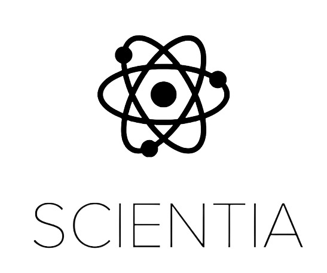
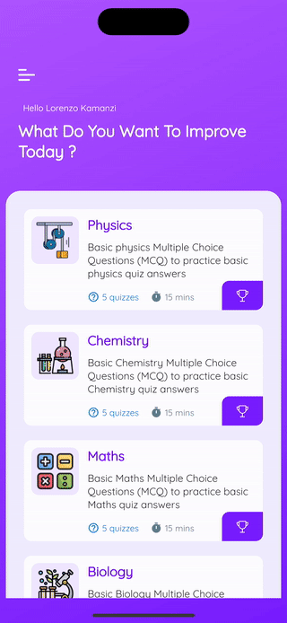

<!-- Improved compatibility of back to top link: See: https://github.com/othneildrew/Best-README-Template/pull/73 -->

<!--
*** Thanks for checking out the Best-README-Template. If you have a suggestion
*** that would make this better, please fork the repo and create a pull request
*** or simply open an issue with the tag "enhancement".
*** Don't forget to give the project a star!
*** Thanks again! Now go create something AMAZING! :D
-->

<!-- PROJECT SHIELDS -->
<!--
*** I'm using markdown "reference style" links for readability.
*** Reference links are enclosed in brackets [ ] instead of parentheses ( ).
*** See the bottom of this document for the declaration of the reference variables
*** for contributors-url, forks-url, etc. This is an optional, concise syntax you may use.
*** https://www.markdownguide.org/basic-syntax/#reference-style-links
-->

[![MIT License][license-shield]][license-url]

<!-- PROJECT LOGO -->
 

  

<h3 align="center">Scientia</h3>

  

    The app is an electronic learning program that provides information, exercises, progress monitoring, and customization options to help students improve their knowledge and understanding of physics, chemistry, and biology.
     
    <a href="https://github.com/kamanzilorenzo/scientia"><strong>Explore the docs »</strong></a>
     
     
    <a href="https://github.com/kamanzilorenzo/scientia">View Demo</a>
    ·
    <a href="https://github.com/kamanzilorenzo/scientia">Report Bug</a>
    ·
    <a href="https://github.com/kamanzilorenzo/scientias">Request Feature</a>
  

<!-- TABLE OF CONTENTS -->

  
Table of Contents

  <ol>
    <li>
      <a href="#about-the-project">About The Project</a>
      <ul>
        <li><a href="#built-with">Built With</a></li>
      </ul>
    </li>
    <li>
      <a href="#getting-started">Getting Started</a>
      <ul>
        <li><a href="#prerequisites">Prerequisites</a></li>
        <li><a href="#installation">Installation</a></li>
      </ul>
    </li>
    <li><a href="#usage">Usage</a></li>
   
    <li><a href="#license">License</a></li>
    <li><a href="#contact">Contact</a></li>
    <li><a href="#acknowledgments">Acknowledgments</a></li>
  </ol>

<!-- ABOUT THE PROJECT -->
## About The Project

 `kamanzilorenzo`, `scientia`, `@lorenzo_kamanzi`, `lorenzokamanzi6@gmail.com`, `Scientia`, `project_description`

(<a href="#readme-top">back to top</a>)

### Built With

* [![Flutter][Flutter.dev]][Flutter-url]

(<a href="#readme-top">back to top</a>)

<!-- USAGE EXAMPLES -->
## Usage

Are you struggling to keep up with your science classes or wanting to brush up on your knowledge? Look no further than the electronic learning program that we have developed! Our app provides a comprehensive and interactive way for students to learn about physics, chemistry, and biology.

The app is user-friendly, with a sleek and simple interface that makes it easy to navigate. Upon opening the app, you will be presented with a variety of topics to choose from. Each topic is accompanied by a brief introduction, followed by in-depth information about the subject matter.

In addition to providing information, the app also includes a variety of exercises to test your understanding of the material. The exercises range from multiple choice questions to interactive simulations, which provide a hands-on way to learn about scientific concepts.

To ensure that you are making progress and staying on track, the app includes a timer and progress bar. The timer helps you keep track of how long you have spent on a particular topic, while the progress bar shows you how much of the topic you have covered.

The app also allows for customization, enabling you to add your own content to the app. This feature is particularly useful for students who are studying specific topics that may not be covered in the app.

We have designed the app to be compatible with all smartphones, ensuring that it is accessible to as many people as possible. With statistics showing that mobile learning can improve productivity by 43%, our app is a valuable resource for learners worldwide.

Overall, our electronic learning program is a comprehensive and interactive way for students to improve their knowledge and understanding of physics, chemistry, and biology. With a variety of topics, exercises, progress monitoring, and customization options, our app is a valuable tool for anyone looking to expand their scientific knowledge.

_For more examples, please refer to the [Documentation](https://example.com)_

(<a href="#readme-top">back to top</a>)

<!-- LICENSE -->
## License

Distributed under the MIT License. See `LICENSE.txt` for more information.

(<a href="#readme-top">back to top</a>)

<!-- CONTACT -->
## Contact

Lorenzo Kamanzi - [@lorenzo_kamanzi](https://twitter.com/lorenzo_kamanzi) - kamanzi_lorenzo06@gmail.com

Project Link: [https://github.com/kamanzilorenzo/scientia](https://github.com/kamanzilorenzo/scientia)

(<a href="#readme-top">back to top</a>)

<!-- MARKDOWN LINKS & IMAGES -->
<!-- https://www.markdownguide.org/basic-syntax/#reference-style-links -->
[contributors-shield]: https://img.shields.io/github/contributors/kamanzilorenzo/repo_name.svg?style=for-the-badge
[contributors-url]: https://github.com/kamanzilorenzo/repo_name/graphs/contributors
[forks-shield]: https://img.shields.io/github/forks/kamanzilorenzo/repo_name.svg?style=for-the-badge
[forks-url]: https://github.com/kamanzilorenzo/repo_name/network/members
[stars-shield]: https://img.shields.io/github/stars/kamanzilorenzo/repo_name.svg?style=for-the-badge
[stars-url]: https://github.com/kamanzilorenzo/scientia/stargazers
[issues-shield]: https://img.shields.io/github/issues/kamanzilorenzo/repo_name.svg?style=for-the-badge
[issues-url]: https://github.com/kamanzilorenzo/scientia/issues
[license-shield]: https://img.shields.io/github/license/kamanzilorenzo/repo_name.svg?style=for-the-badge
[license-url]: https://github.com/kamanzilorenzo/scientia/blob/master/LICENSE.txt
[linkedin-shield]: https://img.shields.io/badge/-LinkedIn-black.svg?style=for-the-badge&logo=linkedin&colorB=555
[linkedin-url]: https://linkedin.com/in/linkedin_username
[product-screenshot]: images/screenshot.png
[Next.js]: https://img.shields.io/badge/next.js-000000?style=for-the-badge&logo=nextdotjs&logoColor=white
[Next-url]: https://nextjs.org/
[React.js]: https://img.shields.io/badge/React-20232A?style=for-the-badge&logo=react&logoColor=61DAFB
[React-url]: https://reactjs.org/
[Vue.js]: https://img.shields.io/badge/Vue.js-35495E?style=for-the-badge&logo=vuedotjs&logoColor=4FC08D
[Vue-url]: https://vuejs.org/
[Angular.io]: https://img.shields.io/badge/Angular-DD0031?style=for-the-badge&logo=angular&logoColor=white
[Angular-url]: https://angular.io/
[Svelte.dev]: https://img.shields.io/badge/Svelte-4A4A55?style=for-the-badge&logo=svelte&logoColor=FF3E00
[Svelte-url]: https://svelte.dev/
[Laravel.com]: https://img.shields.io/badge/Laravel-FF2D20?style=for-the-badge&logo=laravel&logoColor=white
[Laravel-url]: https://laravel.com
[Bootstrap.com]: https://img.shields.io/badge/Bootstrap-563D7C?style=for-the-badge&logo=bootstrap&logoColor=white
[Bootstrap-url]: https://getbootstrap.com
[Flutter.dev]: https://img.shields.io/badge/Flutter-02569B?style=for-the-badge&logo=flutter&logoColor=white
[Flutter-url]: https://flutter.dev
